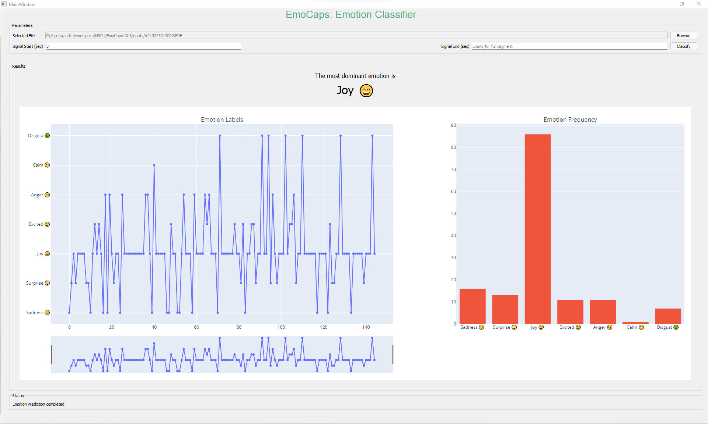

# EmoCaps-GUI

A graphical interface to use the **EmoCaps** model for emotion recognition using EEG signals.

## Installation

First, download the latest [miniconda](https://docs.conda.io/en/latest/miniconda.html) executable and install it on your system.

After that, open the `Anaconda Prompt` and install `mamba` by executing the following command:  
`conda install mamba -n base -c conda-forge`

Once `mamba` is installed, execute the following command to setup the environment:  
`mamba env create -f environment.yml`

## Usage

Once your environment is set, you can execute the EmoCaps GUI application by following these steps:

1. Activate the conda environment: `conda activate emocaps`
2. Navigate to the GUI application directory.
3. Execute the python script: `python gui.py`
